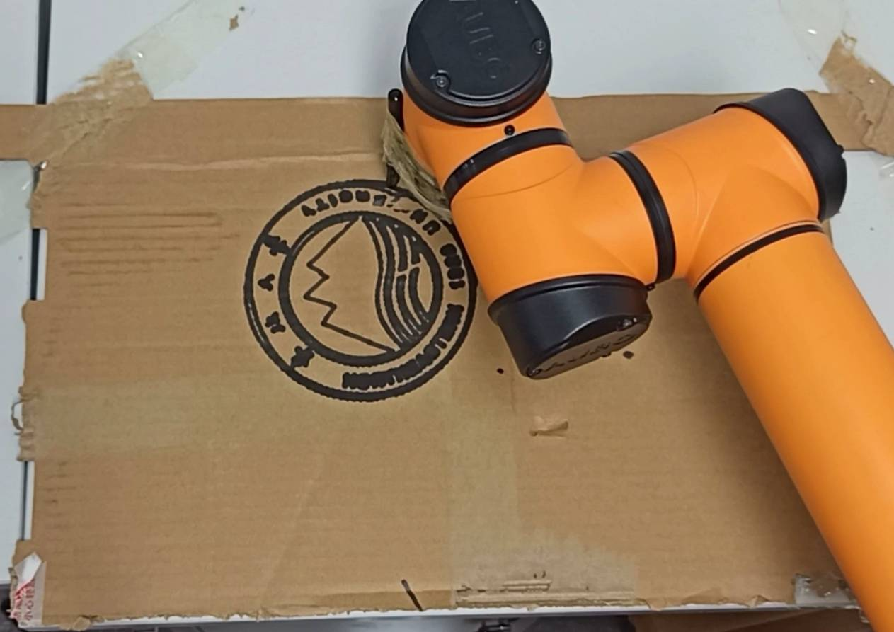

# 语音自主导航绘图机器人

本系统在 Ubuntu 16.04 + ros kinetic下测试通过  
机械臂控制采用move_it  
导航控制采用move_base  
## Contributors
[许焱然*](https://github.com/Xu-Yanran) [李昊佳*](https://github.com/mywisdomfly) [邓志豪](https://github.com/zacdeng) 黄峥沁

*equal contribution
## 展示效果
[YouTube](https://youtu.be/vfwGCcCbXIA)

[BiliBili](https://www.bilibili.com/video/BV1aK411M7H8/)

[](https://www.bilibili.com/video/BV1aK411M7H8/)
## 绘图部分
svg图片边缘轮廓->转为gcode->解析gcode ->运动学逆解执行
### 运行方法
#### 仿真测试
```bash
# 在第一个终端打开
roslaunch aubo_i5_moveit_config moveit_planning_execution.launch robot_ip:=127.0.0.1

# 在第二个终端打开
roslaunch aubo_gazebo aubo_i5_gazebo_control.launch

# 在第三个终端启动绘图程序
roslaunch draw_core start_draw.launch
```
即可看到aubo机械臂在gazebo下正在空中绘制图形


指定gcode文件方法
```bash
roslaunch draw_core simulation_draw.launch file:="your gcode path"
```

#### 实物运行

**1. 原点设定**
```bash
# 在第一个终端启动机械臂 注意替换自己的机械臂IP地址
roslaunch aubo_i5_moveit_config moveit_planning_execution.launch sim:=false robot_ip:=192.168.5.10
```

**使用示教器将机械臂运行到绘制的原点(原点定义为 绘图平面的0,0点 并且该点高度为落笔绘制高度)**

```bash
# 在第二个终端启动绘图程序
rosrun draw_core arm_controller.py
```

记录下终端中 `current_joint_values`的值

填入`draw_core/scripts/arm_controller.py` 中`go_home`函数`joint_positions` 数组中


**2. 运行Gcode 绘制**
```bash
# 在第一个终端启动机械臂 注意替换自己的机械臂IP地址
roslaunch aubo_i5_moveit_config moveit_planning_execution.launch sim:=false robot_ip:=192.168.5.10

# 在第二个终端启动绘图程序
roslaunch draw_core start_draw.launch
```

指定gcode文件方法
```bash
roslaunch draw_core simulation_draw.launch file:="your gcode path"
```

Enjoy it!

**3. SVG图片转Gcode**
```bash
# 别忘记 source ros的工作空间 source devel/setup.bash
roscd draw_core
cd scripts/
python svg_convert.py "your svg path"
```

转换完成的Gcode与图片保存在同一个目录下的gcode_output,并且与图片文件名称相同.

### 文件结构
`aubo_robot` 奥博机械臂驱动  

`industrial_core` 奥博机械臂驱动依赖 

`draw_core` 绘图部分核心代码

- `arm_controller.py` 机械臂控制核心
- `gcode_draw.py` gcode解析与绘制
- `gcode_excute` gcode指令与机械臂控制的中间接口文件
- `svg_convert` svg转gcode
- `py_svg2gcode` svg转Gcode核心代码库
  - `lib/shapes.py` svg形状类型解析
  - `lib/cubicsuperpath.py` 曲线插值
